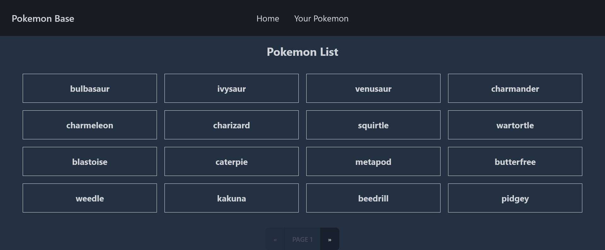
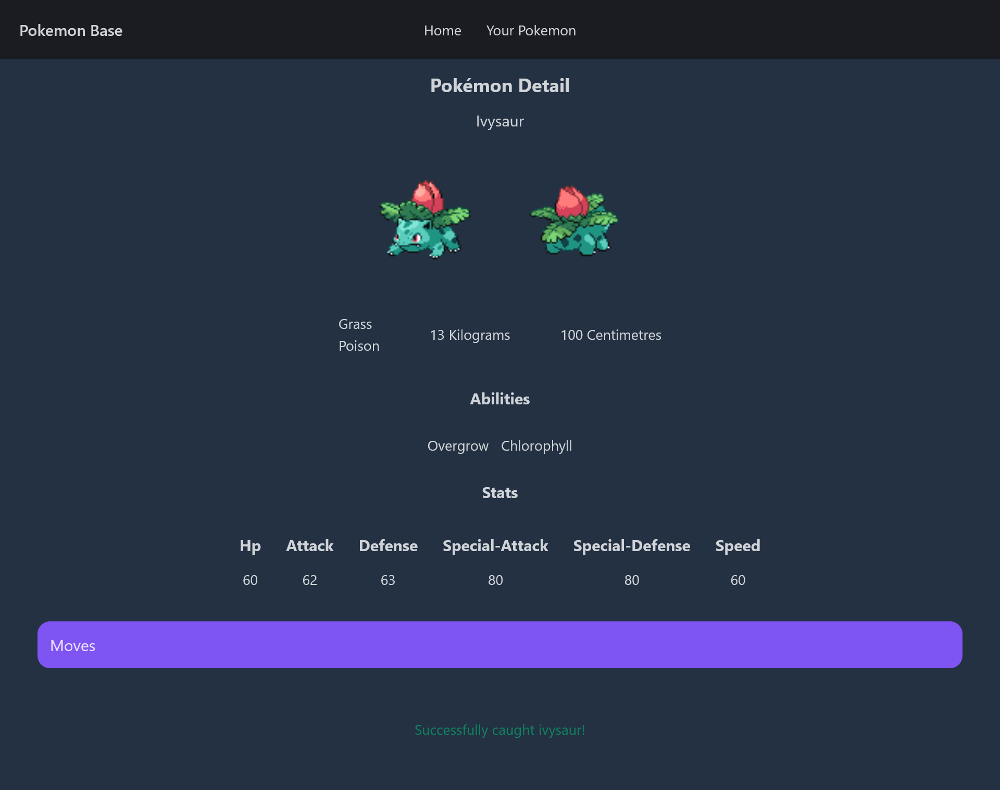
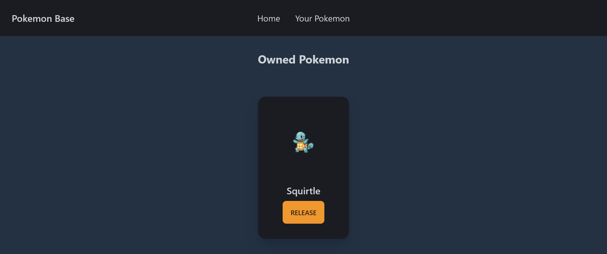

# Pokemon Base
## Gravel Frontend Engineer Internships Challenge
## Purpose

Pokémon Base was created with the aim of making it easier for users to find out the details of the Pokemon that they are searching for. They can also capture Pokemon, and they can release Pokemon that have been captured.

## Tech

Pokemon Base is built with this technology stack:

- React Js (JavaScript Framework)
- TailwindCSS (CSS Framework)
- DaisyUI (TailwindCSS Framework)

And of course Pokemon Base itself is open source with a [public repository](https://github.com/riftxdstudent/pokemon) on GitHub.

## Installation

```
cd pokemon
npm start
```

If you have a problem for run the apps, you can try to check the `react-scripts` is listed on package.json, you can reinstall the dependencies with this command:

``` 
npm install
```

Or if `react-scripts` didn't exist, you can install the package with this command:

``` 
npm install react-scripts
```

``` 
yarn add react-scripts
````

## Screenshots





